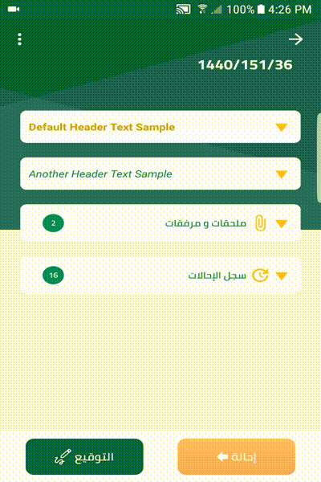

# ExpandableLayout
[  ](https://bintray.com/ma7madfawzy/expandableLayout/com.widget.expandableLayout/_latestVersion)

An Android library that lets you create an expandable layout in a simple and easy way in which you can use the default header and content OR pass your custom layout and just expand and collapse magic is all ready.

r

## Quick Setup

### 1- Include library

#### Using Gradle
```
dependencies {
implementation  'com.widget:expandableLayout:2+'
}
```
#### Using Maven
```
<dependency>
  <groupId>com.widget</groupId>
  <artifactId>expandableLayout</artifactId>
  <version>1+</version>
  <type>pom</type>
</dependency>

```
## 2- Usage

### 2.1 XML Layout:

 ```
<widget.com.expandablelayout.ExpandableLayout
 android:layout_width="match_parent"
 android:layout_height="wrap_content"
 <!--expand/collabse duration ,default 300-->
 app:duration="400"
 <!--default false-->
 app:hideArrow="true"
 app:arrow_icon="@drawable/arrow_down"
 app:header_padding="16dp"
 app:content_padding="10dp"
 <!--default false-->
 app:startExpanded="true"
 <!--use your own custom layout-->
 app:content_layout="@layout/custom_content"
 app:header_layout="@layout/layout_expandable_header"
 <!--Or use default layout which is a TextView-->
 app:header_title="Header default Text sample"
 app:content_text="Content Text Sample"
 <!--fonts is the folder name in Assets-->
 app:header_font="fonts/fontName.ttf"
 app:content_font="fonts/fontName.ttf"'
 app:header_color="@color/colorAccentDark"
 app:content_color="@color/colorAccent"
 app:header_padding="10dp"
 app:content_padding="14dp"
 app:header_text_style="italic"
 app:content_text_style="bold"/> 

```
#### You can use the default HeaderTV and ContentTV

##### ````header_title```` sets the text of the headerTV 
##### ````header_color```` sets the textColor of the headerTV
##### ````arrow_icon```` sets the resource of the arrowBtn (which is visible with using the default headerTV) 

##### ````content_text````   sets the text of the contentTV
##### ````content_color```` sets the textColor of the contentTV

##### ````duration```` sets the duration of the collabse and expand animation

#### Or you can use set a custom header or a custom content 

##### ````header_layout````   sets the declared layout resource as the header layout
##### ````content_layout```` sets the declared layout resource as the content layout 

#### You can use toggle() to reverse the state, and use isExpanded() to check if it was expanded or not.

#### setOnExpandedListener that can be used to listen to state change:
````
expandableLayout.setOnExpandedListener(new OnExpandedListener() {
    @Override
    public void onExpandChanged(View view, boolean isExpanded) {
        //TODO handle onExpandChanged
    }
});
````

### 2.2 Dynamically:

#### In Java:

````
ExpandableLayout expandableLayout=new ExpandableLayout(context);
````
##### Default HeaderTV and ContentTV
````
expandableLayout.setDefaultHeaderTitle("Added Through Java");
expandableLayout.setDefaultContentTitle("Content xxx");
expandableLayout.setArrowDrawable(R.drawable.arrow_ic);
````

##### Custom HeaderTV OR ContentTV
````
expandableLayout.setHeaderLayout(R.layout.custom_header);
expandableLayout.setContentLayout(R.layout.custom_content);
````
#### In Kotlin:

````
var expandableLayout = ExpandableLayout(context)
````
##### Default HeaderTV and ContentTV
````
expandableLayout.setDefaultHeaderTitle("Added Through Kotlin")
expandableLayout.setDefaultContentTitle("Content xxx")
expandableLayout.setArrowDrawable(R.drawable.arrow_ic)
````

##### Custom HeaderTV OR ContentTV
````
expandableLayout.setHeaderLayout(R.layout.custom_header)
expandableLayout.setContentLayout(R.layout.custom_content)
````
##### Adding the layout to container view
````
container.addView(expandableLayout)
````
##### Then you can trigger your custom layouts using:
###### For DataBinding lovers 
````
expandable.getHeaderLayoutBinding();//returns ViewDataBinding which can be cast to your layout name
expandable.getContentLayoutBinding();
````
###### Or just a simple view
````
expandable.getHeaderLayoutView();
expandable.getContentLayoutView();
````

### Happy Coding

## Authors

* [Mohammed Fawzy](https://github.com/ma7madfawzy)
* [Ali Gamal](https://github.com/aligamal-dev)
* [Muhammad Noamany](https://github.com/muhammadnomany25)


## License

This project is licensed under the MIT License - see the [LICENSE.md](LICENSE.md) file for details

